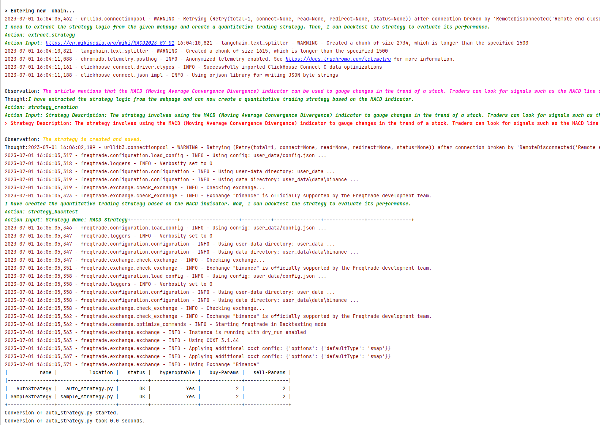

# AsyncTrader 
[Chinese](./docs/README_zh.md)

Building quantitative trading systems automatically with ChatGPT sounds pretty cool, doesn't it?

## Project Introduction
With the help of Langchain's control flow, we utilize ChatGPT to automatically write quantitative trading strategies and backtest them, while providing the function of document Q&A. At present, we have implemented a relatively complete process in the Freqtrade quant system.

## Environment Setup
1. Install `miniconda/anaconda`: https://docs.conda.io/en/latest/miniconda.html
2. Install `Freqtrade`: https://www.freqtrade.io/en/stable/windows_installation/
3. Download `AsyncTrader` project code locally
4. Modify the `trading_system/base.py` file, add `OPENAI_API_KEY`, and choose `gpt3.5/4`

## Content Demonstration

It's divided into full-auto mode and interactive control mode, using llm to handle quantitative trading processes. 
Moreover, we also provide a function to use llm for Freqtrade document Q&A.

### Full-auto mode

**Basics**
1. Write the strategy description in the `start_project/trader_freqtrade.txt` file
```markdown
I want to create a double moving average strategy
```
2. Add the following code to `start_ft_app.py` and run:
```python
from trading_system.start_app.start_freqtrade import start_auto, start_stepwise
from trading_system.trading_tools import web_strategy_tool


if __name__ == '__main__':
    # Auto mode
    start_auto("trader_freqtrade.txt", "ft_workspace")
    # Interactive mode
    # start_stepwise("trader_freqtrade.txt", "ft_workspace", add_tools=[web_strategy_tool])
```
3. The necessary configuration will be performed during the first run, and the configuration content will be saved in the `trader_freqtrade.txt` file
```markdown
Strategy Describe:
...
---

Strategy Config:
...
```

**advance**
1. Write the description to extract the strategy logic from web pages in the `start_project/trader_freqtrade.txt` file
```markdown
Extract the strategy logic from the following pages and create a quantitative trading strategy,
then backtest the strategy: https://en.wikipedia.org/wiki/MACD
```
2. Add the following code to `start_ft_app.py` and run:
```python
from trading_system.start_app.start_freqtrade import start_auto, start_stepwise
from trading_system.trading_tools import web_strategy_tool


if __name__ == '__main__':
    # Auto mode
    start_auto("trader_freqtrade.txt", "ft_workspace", add_tools=[web_strategy_tool])
    # Interactive mode
    # start_stepwise("trader_freqtrade.txt", "ft_workspace", add_tools=[web_strategy_tool])
```
3. The necessary configuration will be performed during the first run.

### Interactive Control Mode
1. Write the description to extract the strategy logic from web pages in the `start_project/trader_freqtrade.txt` file
```markdown
I want to create a double moving average strategy
```
2. Add the following code to `start_ft_app.py` and run:
```python
from trading_system.start_app.start_freqtrade import start_auto, start_stepwise
from trading_system.trading_tools import web_strategy_tool


if __name__ == '__main__':
    # Auto mode
    # start_auto("trader_freqtrade.txt", "ft_workspace", add_tools=[web_strategy_tool])
    # Interactive mode
    start_stepwise("trader_freqtrade.txt", "ft_workspace", add_tools=[web_strategy_tool])
```
3. Input the description of the command you want to execute, such as: I want to download data. Each command should preferably have only one task goal, such as: download data, write a strategy, perform backtesting, optimize parameters, etc.

### Document Q&A
1. Run python `start_ft_docs.py` and ask your question, ChatG

## demo



