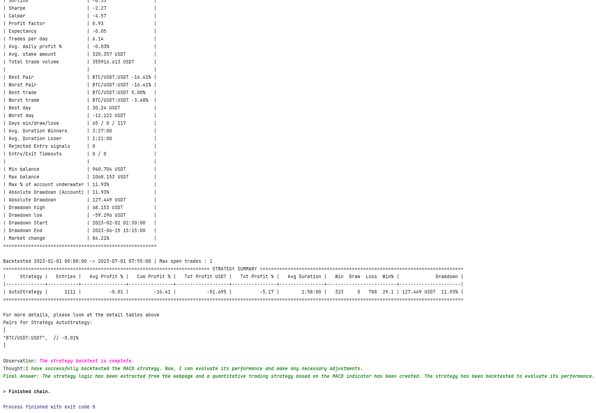

# AsyncTrader
[English](../README.md)

用ChatGPT自动构建量化交易系统, 听起来很有趣.

## 项目介绍
借助langchain控制流程, 利用ChatGPT自动编写量化交易策略并进行回测, 同时提供文档问答的功能. 目前在Freqtrade量化系统中实现了较为完整的流程.

## 环境安装
1. 安装miniconda/anaconda: https://docs.conda.io/en/latest/miniconda.html
2. 安装Freqtrade: https://www.freqtrade.io/en/stable/windows_installation/
3. 下载AsyncTrader项目代码到本地
4. 修改`trading_system/base.py`文件, 添加`OPENAI_API_KEY`和选择`gpt3.5/4`

## 内容演示
分为全自动模式和交互控制模式, 利用llm处理量化交易流程, 此外还提供了利用llm进行Freqtrade文档问答的功能

### 全自动模式

**基础**
1. 在`start_project/trader_freqtrade.txt`文中编写策略描述
```markdown
I want to create a double moving average strategy
```
2. 在`start_ft_app.py`中添加如下代码并运行:
```python
from trading_system.start_app.start_freqtrade import start_auto, start_stepwise
from trading_system.trading_tools import web_strategy_tool


if __name__ == '__main__':
    # Auto mode
    start_auto("trader_freqtrade.txt", "ft_workspace")
    # Interactive mode
    # start_stepwise("trader_freqtrade.txt", "ft_workspace", add_tools=[web_strategy_tool])
```
3. 首次运行时会进行必要的配置, 并将配置内容保存在`trader_freqtrade.txt`文件中
```markdown
Strategy Describe:
...
---

Strategy Config:
...
```

**进阶**
1. 在`start_project/trader_freqtrade.txt`文中编写从网页中提取策略逻辑的描述
```markdown
Extract the strategy logic from the following pages and create a quantitative trading strategy,
then backtest the strategy: https://en.wikipedia.org/wiki/MACD
```
2. 在`start_ft_app.py`中添加如下代码并运行:
```python
from trading_system.start_app.start_freqtrade import start_auto, start_stepwise
from trading_system.trading_tools import web_strategy_tool


if __name__ == '__main__':
    # Auto mode
    start_auto("trader_freqtrade.txt", "ft_workspace", add_tools=[web_strategy_tool])
    # Interactive mode
    # start_stepwise("trader_freqtrade.txt", "ft_workspace", add_tools=[web_strategy_tool])
```
3. 首次运行时会进行必要的配置

### 交互控制模式
1. 在`start_project/trader_freqtrade.txt`文中编写从网页中提取策略逻辑的描述
```markdown
I want to create a double moving average strategy
```
2. 在`start_ft_app.py`中添加如下代码并运行:
```python
from trading_system.start_app.start_freqtrade import start_auto, start_stepwise
from trading_system.trading_tools import web_strategy_tool


if __name__ == '__main__':
    # Auto mode
    # start_auto("trader_freqtrade.txt", "ft_workspace", add_tools=[web_strategy_tool])
    # Interactive mode
    start_stepwise("trader_freqtrade.txt", "ft_workspace", add_tools=[web_strategy_tool])
```
3. 输入需要执行命令的相关描述, 比如: 我想下载数据. 每次给出的命令最好只有一个任务目标, 比如: 下载数据, 编写策略, 进行回测, 参数优化等. 

### 文档查询
1. 运行`python start_ft_docs.py`然后进行提问, ChatGPT会根据Freqtrade文档给出答案

## 演示



