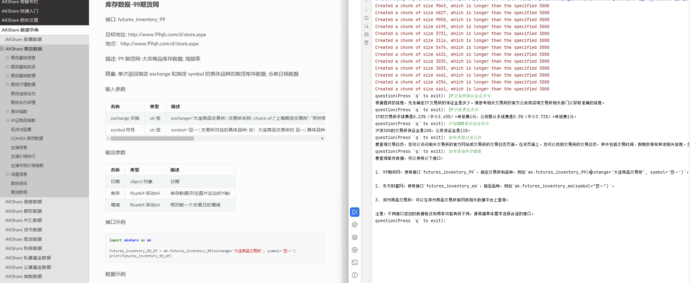
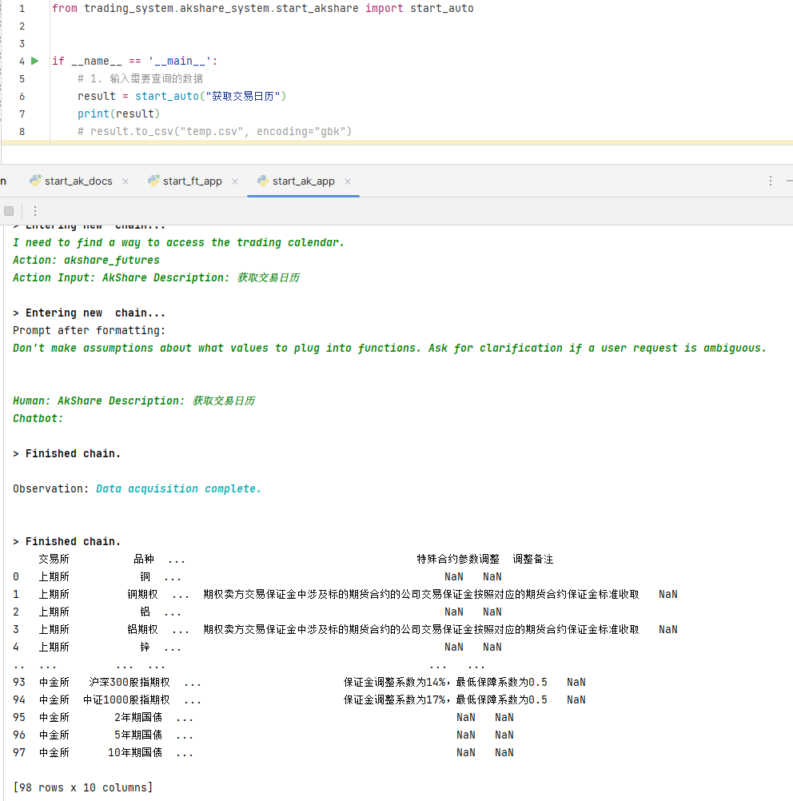

## AkShare

## Demonstration

AkShare official documentation: https://akshare.akfamily.xyz/introduction.html#id2

AkShare is completely an ancillary product. We found there was no free trading data available when we were using vnpy for strategy writing and backtesting. Hence, the AkShare project was added.

When using the document Q&A feature, due to the lengthy content of the AkShare document, you must use the gpt-3.5-turbo-16k-0613 or gpt-4-32k-0613 model when selecting the model.

The execution function of AkShare currently only supports domestic futures related functions in China. This function is implemented through ChatGPT's function call. If you want to add more functions, you can mimic and expand the `trading_system/akshare_system/akshare_functions.py` file.

### Q&A

```python
import os
from trading_system.retrieval_qa import retrieval


if __name__ == '__main__':
    # 1. 输入文档路径
    ak_docs_path = os.path.abspath("../akshare/docs/data/futures")
    # 2. 进行文档问答
    retrieval(ak_docs_path)
```



### Execution

```python
from trading_system.akshare_system.start_akshare import start_auto


if __name__ == '__main__':
    # 1. 输入需要查询的数据
    result = start_auto("获取交易日历")
    print(result)
    # result.to_csv("temp.csv", encoding="gbk")
```


