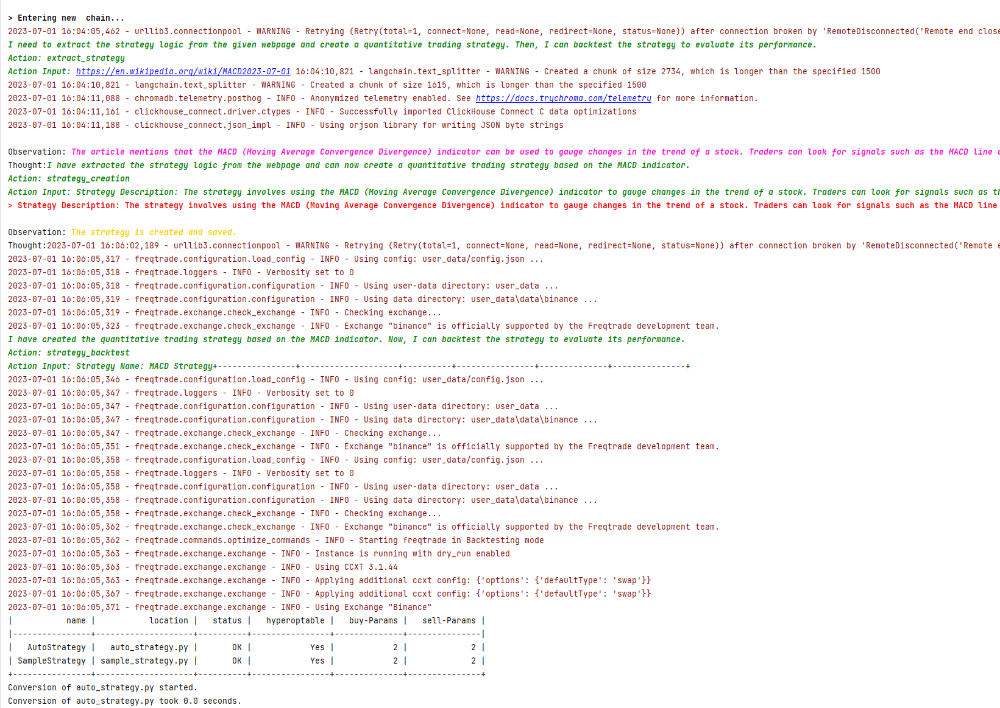

## Freqtrade

## Demonstration
There are two modes: fully automatic mode and interactive control mode. We use llm to handle the quantitative trading process, and also provide the function of using llm for Freqtrade document Q&A.

### Automatic Mode

**Basic**
1. Write the strategy description in the `start_project/trader_freqtrade.txt` file.
```markdown
I want to create a double moving average strategy
```
2. Add the following code to `start_ft_app.py` and run it:
```python
from trading_system.start_app.start_freqtrade import start_auto, start_stepwise
from trading_system.trading_tools import web_strategy_tool


if __name__ == '__main__':
    # Auto mode
    start_auto("trader_freqtrade.txt", "ft_workspace")
    # Interactive mode
    # start_stepwise("trader_freqtrade.txt", "ft_workspace", add_tools=[web_strategy_tool])
```
3. The necessary configurations will be made during the first run, and the configuration content will be saved in the `trader_freqtrade.txt` file.
```markdown
Strategy Describe:
...
---

Strategy Config:
...
```

**Advanced**
1. Write a description in `start_project/trader_freqtrade.txt` to extract the strategy logic from the web page.
```markdown
Extract the strategy logic from the following pages and create a quantitative trading strategy,
then backtest the strategy: https://en.wikipedia.org/wiki/MACD
```
2. Add the following code to `start_ft_app.py` and run:
```python
from trading_system.start_app.start_freqtrade import start_auto, start_stepwise
from trading_system.trading_tools import web_strategy_tool


if __name__ == '__main__':
    # Auto mode
    start_auto("trader_freqtrade.txt", "ft_workspace", add_tools=[web_strategy_tool])
    # Interactive mode
    # start_stepwise("trader_freqtrade.txt", "ft_workspace", add_tools=[web_strategy_tool])
```
3. The necessary configurations will be made during the first run.

### Interactive Control Mode
1. Write a description in `start_project/trader_freqtrade.txt` to extract the strategy logic from the web page.
```markdown
I want to create a double moving average strategy, then backtest the strategy
```
2. Add the following code to `start_ft_app.py` and run:
```python
from trading_system.start_app.start_freqtrade import start_auto, start_stepwise
from trading_system.trading_tools import web_strategy_tool


if __name__ == '__main__':
    # Auto mode
    # start_auto("trader_freqtrade.txt", "ft_workspace", add_tools=[web_strategy_tool])
    # Interactive mode
    start_stepwise("trader_freqtrade.txt", "ft_workspace", add_tools=[web_strategy_tool])
```
3. Enter the description of the command you need to execute, for example: I want to download data. It's best if each command given only has one task objective, such as: download data, write strategy, backtest, parameter optimization, etc.

### Q&A
1. Run python `start_ft_docs.py` then ask a question, ChatGPT will give answers based on the Freqtrade documentation.
```python
import os
import freqtrade
from trading_system.retrieval_qa import retrieval


if __name__ == '__main__':
    freqtrade_docs_path = os.path.join(os.path.dirname(os.path.dirname(freqtrade.__file__)), "docs")
    retrieval(freqtrade_docs_path)
```

## Demonstration

1. Execution




2. Q&A


