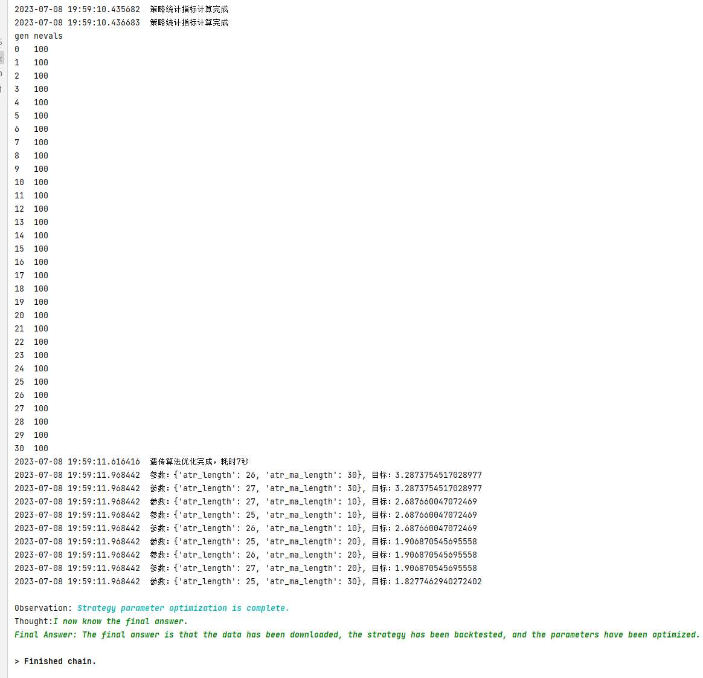
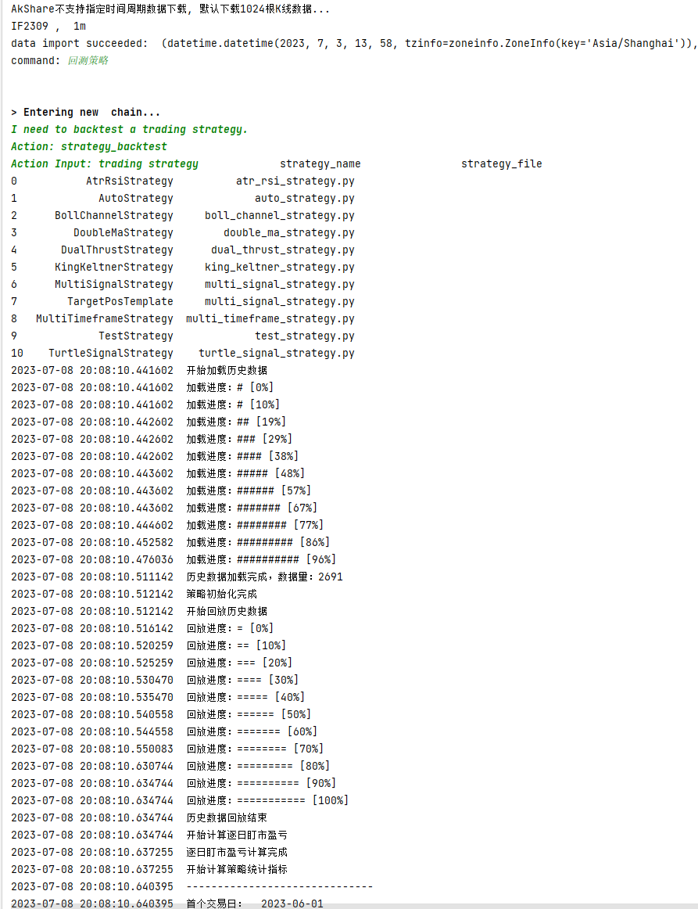
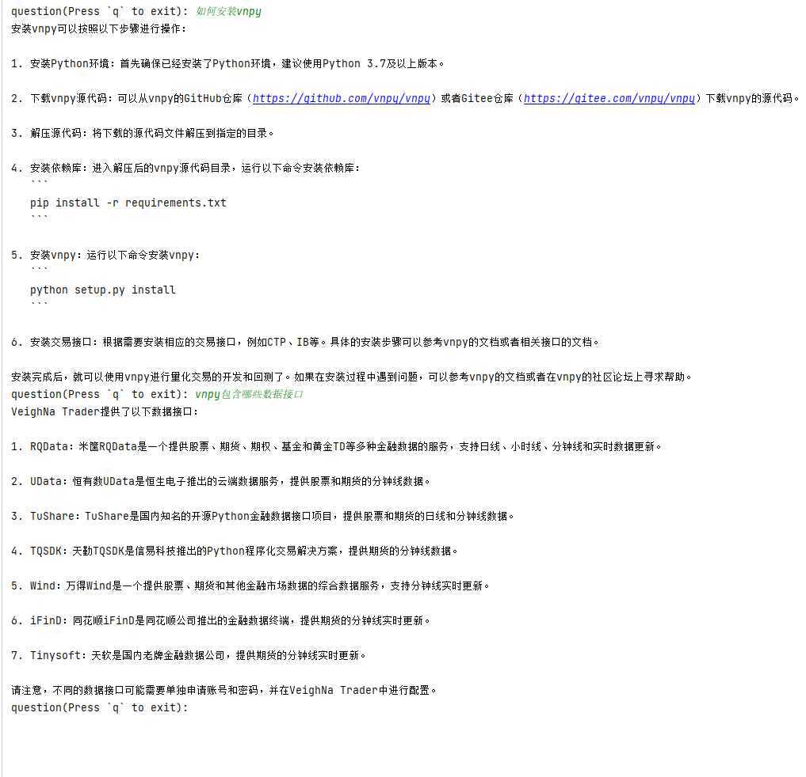

## Vnpy

## Execution
I'm sorry, Vnpy cannot directly generate executable trading strategies like Freqtrade at this moment. 

It's necessary to explain some related content:
1. The database used by ChatGPT is up to date until September 12, 2021, after which the Vnpy version was updated, therefore import package errors will occur when generating strategies.
2. ChatGPT's support for Chinese corpus is not friendly enough, so in addition to the import errors (minor issue), detailed errors will occur in the code when writing strategies (major issue).
3. The above two issues can be appropriately solved by adjusting the prompts (currently not solved yet). In order to smoothly demonstrate the complete process, we can only use Vnpy's default AtrRsiStrategy strategy for demonstration.
4. The default working path for Vnpy data and configuration is C:/Users/.../.vntrader.
5. Install the Vnpy strategy package vnpy_ctastrategy, the default strategy path is Lib/site-packages/vnpy_ctastrategy/strategies.
6. Vnpy provides multiple data interfaces, but they all need to be purchased. The current project uses the AkShare package to provide 1024 K-line data, which is sufficient to complete the demonstration content. If you want to add a custom data interface, you can rewrite the trading_system/vnpy_system/vnpy_commands.py file.

If you have prompts that can allow ChatGPT to directly generate a complete strategy using Vnpy, we welcome you to share them with us.

### Automatic Mode

1. Add the following code to `start_vnpy_app.py` and run:
```python
from trading_system.vnpy_system.start_vnpy import start_auto, start_stepwise


if __name__ == '__main__':
    start_auto("trader_vnpy.txt")
    # start_stepwise("trader_vnpy.txt")
```




### Interactive Control Mode
1. Add the following code to `start_vnpy_app.py` and run:
```python
from trading_system.vnpy_system.start_vnpy import start_auto, start_stepwise


if __name__ == '__main__':
    # start_auto("trader_vnpy.txt")
    start_stepwise("trader_vnpy.txt")
```
2. Enter the description of the command you need to execute, for example: I want to download data. It's best if each command given only has one task objective, such as: download data, write strategy, backtest, parameter optimization, etc. 



### Q&A

```python
import os
from trading_system.retrieval_qa import retrieval


if __name__ == '__main__':
    # 1. 输入文档路径
    ak_docs_path = os.path.abspath("../vnpy/docs")
    # 2. 进行文档问答
    retrieval(ak_docs_path)
```


