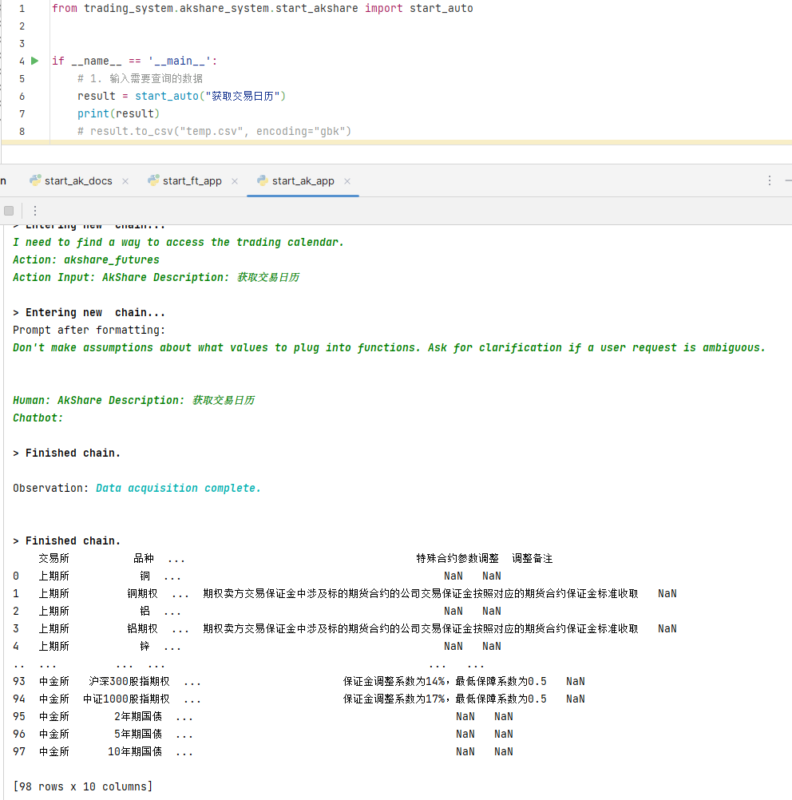

## AkShare

## 内容演示

AkShare官方文档: https://akshare.akfamily.xyz/introduction.html#id2

AkShare其实完全是一个附属产品, 当我们利用vnpy进行策略编写及回测时发现并没有免费的交易数据可用. 因此, 便添加了AkShare项目. 

在使用文档问答功能时, 由于AkShare文档内容过长, 在选择模型时必须使用`gpt-3.5-turbo-16k-0613`或`gpt-4-32k-0613`模型.

AkShare的执行功能目前只支持中国国内期货相关功能, 该功能是通过ChatGPT的`function call`, 功能实现的, 如果想添加更多功能, 可以仿照并扩充`trading_system/akshare_system/akshare_functions.py`文件

### 文档问答

```python
import os
from trading_system.retrieval_qa import retrieval


if __name__ == '__main__':
    # 1. 输入文档路径
    ak_docs_path = os.path.abspath("../akshare/docs/data/futures")
    # 2. 进行文档问答
    retrieval(ak_docs_path)
```


### 功能执行

```python
from trading_system.akshare_system.start_akshare import start_auto


if __name__ == '__main__':
    # 1. 输入需要查询的数据
    result = start_auto("获取交易日历")
    print(result)
    # result.to_csv("temp.csv", encoding="gbk")
```

## 演示


