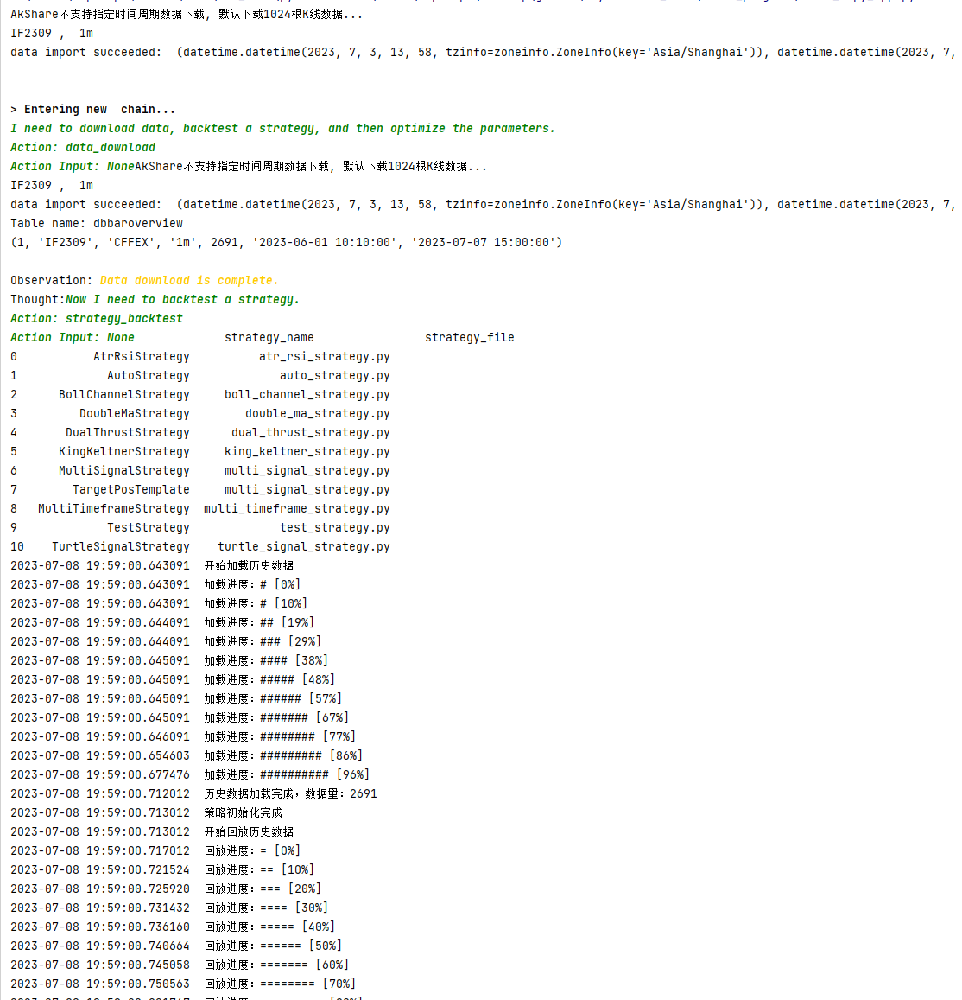
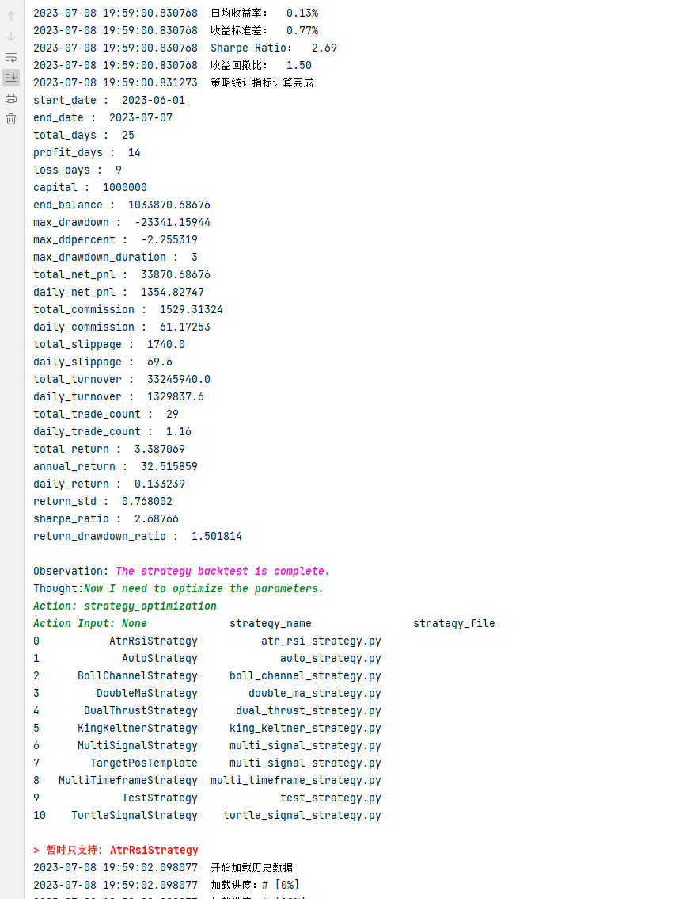
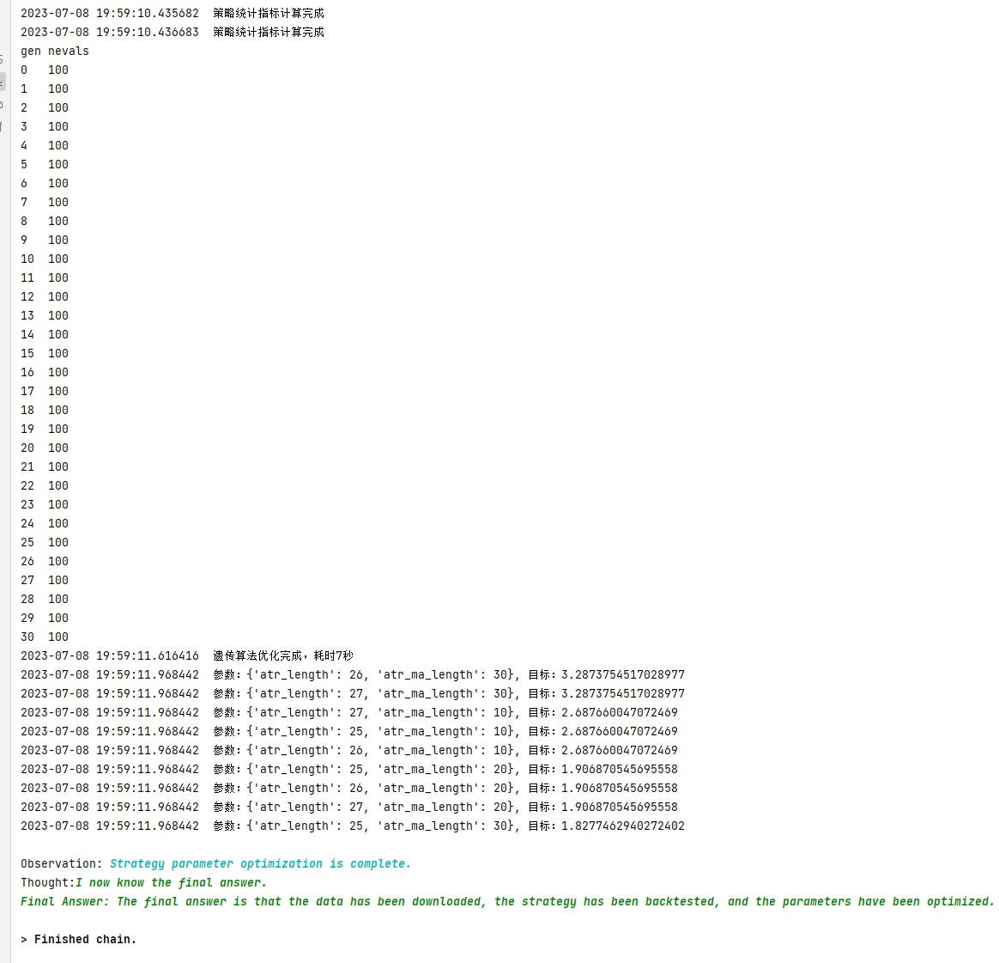
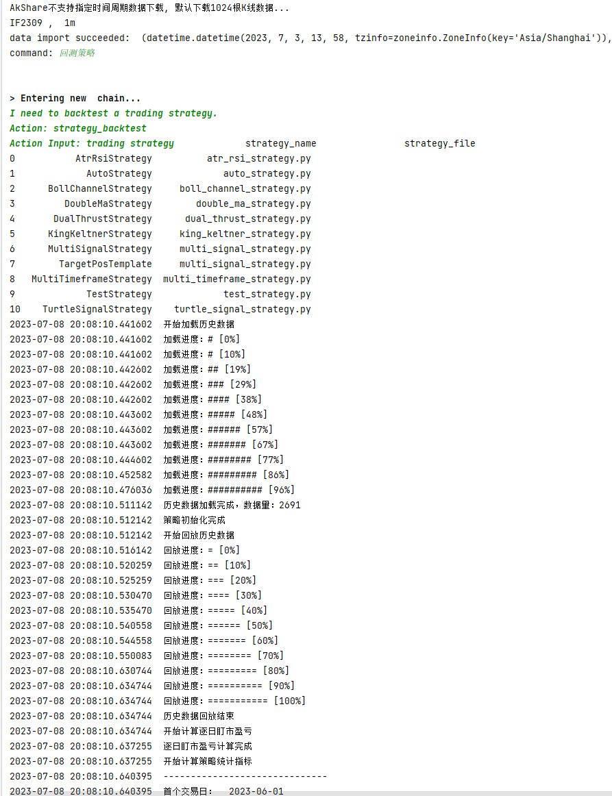
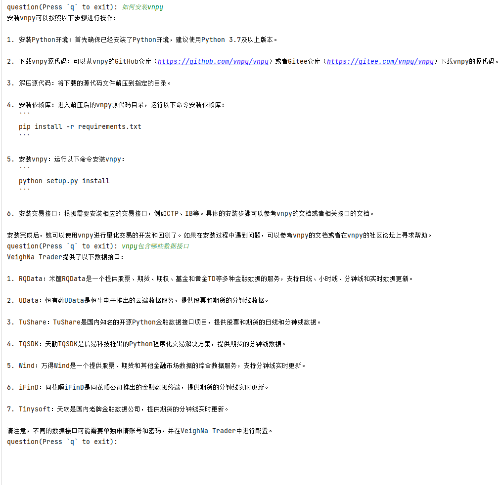

## Vnpy

## 内容演示
很抱歉, Vnpy暂时无法像Freqtrade一样可以直接生成可执行的交易策略. 

有必要说明一下相关内容, 
1. ChatGPT使用的资料库截止到2021年9月12, 后来Vnpy版本更新, 因此生成策略时会出现导入包错误
2. ChatGPT对中文语料支持不够友好, 因此除了导包错误(小问题), 在编写策略时会代码会出现细节山的错误(大问题)
3. 上述两个问题可以通过调整提示词得到适当解决(目前暂未解决), 当前为了顺利演示完整流程, 只能使用vnpy默认的`AtrRsiStrategy`策略演示
4. vnpy数据和配置默认的工作路径是`C:/Users/.../.vntrader`
5. 安装vnpy策略工具包`vnpy_ctastrategy`, 策略路径默认`Lib/site-packages/vnpy_ctastrategy/strategies`
6. vnpy提供了多个数据接口, 但是都需要付费购买, 当前项目使用AkShare工具包可以提供1024根K线数据, 足够完成演示内容, 如果想添加自定义数据接口, 可以仿照重写`trading_system/vnpy_system/vnpy_commands.py`文件

如果你有可以让ChatGPT使用vnpy直接生成完整策略的提示词, 欢迎与我们分享.

### 全自动模式

1. 在`start_ft_app.py`中添加如下代码并运行:
```python
from trading_system.vnpy_system.start_vnpy import start_auto, start_stepwise


if __name__ == '__main__':
    start_auto("trader_vnpy.txt")
    # start_stepwise("trader_vnpy.txt")
```







### 交互控制模式
1. 在`start_ft_app.py`中添加如下代码并运行:
```python
from trading_system.vnpy_system.start_vnpy import start_auto, start_stepwise


if __name__ == '__main__':
    # start_auto("trader_vnpy.txt")
    start_stepwise("trader_vnpy.txt")
```
2. 输入需要执行命令的相关描述, 比如: 我想下载数据. 每次给出的命令最好只有一个任务目标, 比如: 下载数据, 编写策略, 进行回测, 参数优化等. 



### 文档问答

```python
import os
from trading_system.retrieval_qa import retrieval


if __name__ == '__main__':
    # 1. 输入文档路径
    ak_docs_path = os.path.abspath("../vnpy/docs")
    # 2. 进行文档问答
    retrieval(ak_docs_path)
```


